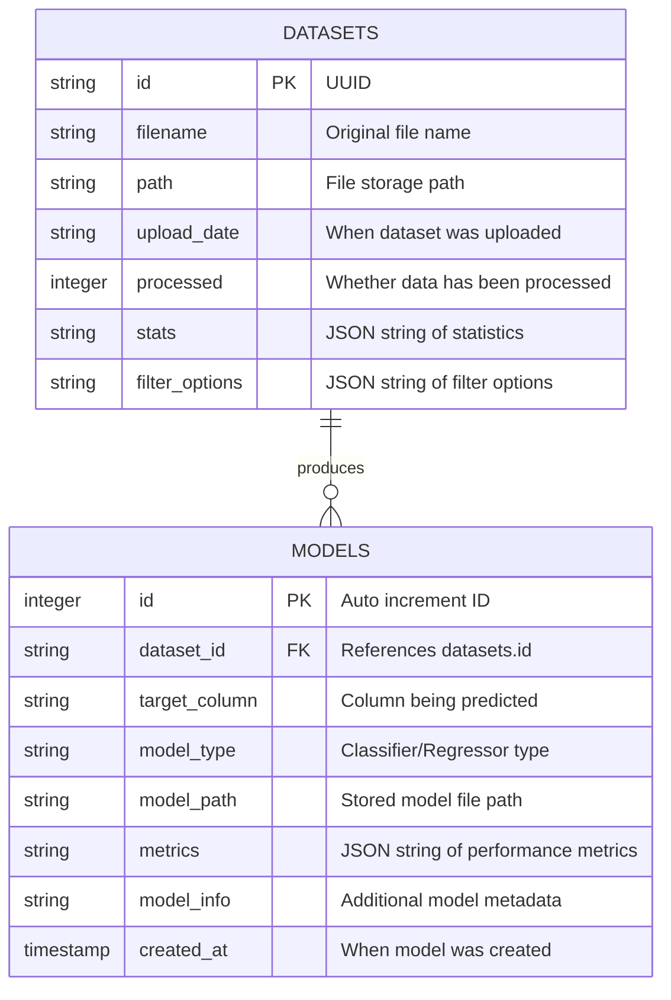

# AI Adoption System - Entity Relationship Diagram

## AI Adoption System Database Structure

The AI Adoption System implements a predictive modeling platform focused on enhancing teaching and learning processes at Chinhoyi University of Technology. The database schema is intentionally lightweight and flexible, designed to support:

1. Dataset management for educational data analysis
2. Multiple machine learning model creation and evaluation
3. Predictive insights generation for improving teaching and learning

### Key Entities

#### DATASETS
The DATASETS entity stores information about uploaded data files:
- **id**: Unique identifier generated as UUID
- **filename**: Original name of the uploaded CSV file
- **path**: File system location where the data is stored
- **upload_date**: When the dataset was uploaded
- **processed**: Flag indicating whether the data has been processed for analysis
- **stats**: JSON string containing dataset statistics (column types, ranges, distributions)
- **filter_options**: JSON string with possible filtering options for the dashboard

#### MODELS
The MODELS entity stores information about machine learning models trained on datasets:
- **id**: Auto-incremented unique identifier
- **dataset_id**: Foreign key linking to the dataset used to train this model
- **target_column**: Name of the column/variable being predicted
- **model_type**: Type of machine learning model (e.g., "linear_regression", "random_forest", etc.)
- **model_path**: File system location where the serialized model is stored
- **metrics**: JSON string containing performance metrics (accuracy, R², RMSE, etc.)
- **model_info**: Additional model metadata as a JSON string
- **created_at**: Timestamp when the model was created

### System Implementation

The AI Adoption System uses this database structure to support the following workflows:

1. **Data Upload and Analysis**:
   - Users upload educational datasets (CSV files)
   - System validates and processes data
   - Statistical analysis generates insights about the data

2. **Model Training**:
   - Users select target variables to predict
   - Multiple model types can be trained on the same dataset
   - System evaluates and compares model performance

3. **Insight Generation**:
   - Models identify key factors affecting educational outcomes
   - Feature importance analysis highlights significant variables
   - Predictions help inform teaching and learning strategies

4. **Decision Support**:
   - Educational stakeholders use insights to improve teaching methods
   - Data-driven decisions enhance student learning experiences
   - Predictive analytics supports institutional planning

This schema, while simple, provides flexibility to handle various types of educational data and predictive modeling tasks. The extensive use of JSON fields (stored as TEXT) allows for dynamic data structures without requiring complex database schemas. 