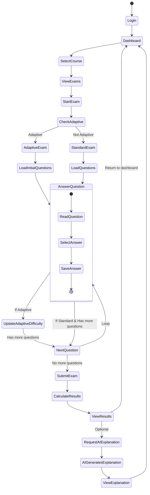
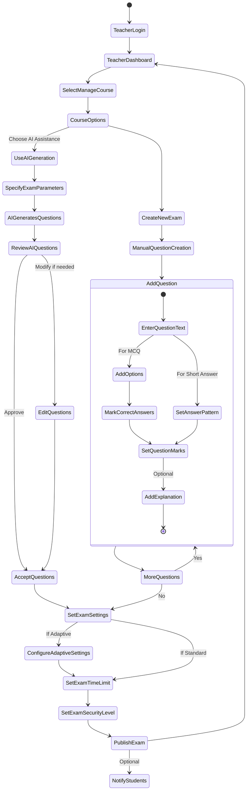
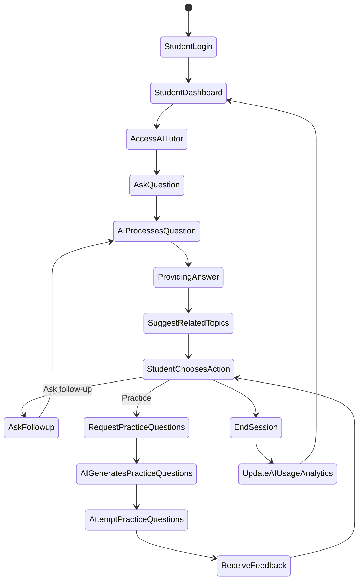
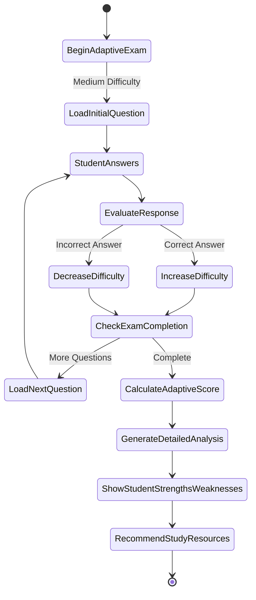

# Online Examination System - Activity Diagrams

## Student Exam Taking Flow

## Teacher Exam Creation Flow

## AI-Enhanced Learning Flow

## Adaptive Exam Flow

## Activity Diagram Description

The activity diagrams above illustrate the key workflows within the Online Examination System:

### Student Exam Taking Flow
This diagram depicts how students navigate through the process of taking an exam:
- Login and access their dashboard
- Select a course and view available exams
- Take either standard or adaptive exams
- Answer questions sequentially
- Submit the exam and view results
- Optionally request AI-generated explanations for difficult questions

### Teacher Exam Creation Flow
This diagram shows how teachers create and manage exams:
- Login to their dashboard and select a course to manage
- Choose between manual creation or AI-assisted generation
- Add questions with various configurations (multiple choice, short answer)
- Set exam parameters (time limits, security settings)
- Configure adaptive settings if applicable
- Publish the exam to students

### AI-Enhanced Learning Flow
This diagram illustrates the AI tutoring capabilities:
- Student accesses the AI tutor from their dashboard
- Asks questions and receives answers with related topic suggestions
- Can request practice questions based on weak areas
- System tracks AI usage analytics throughout the session

### Adaptive Exam Flow
This diagram shows the dynamic nature of adaptive assessments:
- Questions adjust in difficulty based on student performance
- System evaluates responses and increases/decreases difficulty accordingly
- Generates detailed analysis of student strengths and weaknesses
- Provides personalized study resource recommendations

These activity diagrams comprehensively model the dynamic behavior of the Online Examination System, highlighting both traditional features and AI-enhanced capabilities that support personalized learning experiences. 