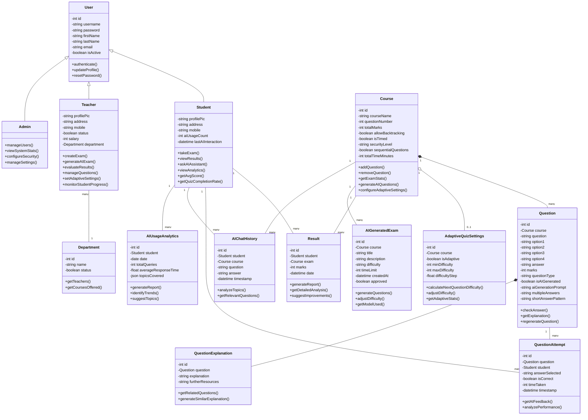

# Online Examination System - Class Diagram

## Class Diagram Description

This class diagram represents the object-oriented structure of the Online Examination System, including AI-enhanced features. Below are the key components and their relationships:

### User Management Classes

- **User** (Abstract): Base class for all user types with common attributes like username, password, email
  - **Student**: Users who take exams and interact with AI study tools
  - **Teacher**: Users who create and manage exams, generate AI questions
  - **Admin**: System administrators with full control

- **Department**: Organizes teachers by academic department

### Course & Question Management

- **Course**: Represents academic subjects with exam configuration options
- **Question**: Individual exam questions with various formats (multiple choice, short answer)
- **QuestionExplanation**: Detailed explanations of questions for learning purposes

### Assessment Classes

- **QuestionAttempt**: Records of student attempts at specific questions
- **Result**: Exam results linking students to courses and performance metrics

### AI-Enhanced Feature Classes

- **AdaptiveQuizSettings**: Configuration for adaptive difficulty exams
- **AIGeneratedExam**: Exams created using AI with difficulty settings
- **AIChatHistory**: Record of student interactions with AI assistant
- **AIUsageAnalytics**: Analytics of student AI feature usage

### Key Relationships

1. Inheritance relationships (Student, Teacher, Admin inherit from User)
2. Aggregation (Courses contain Questions)
3. Association (Students take Exams, Teachers manage Courses)
4. Composition (Questions have Explanations)

This class diagram illustrates how the system integrates traditional learning management capabilities with AI-powered features to enhance both teaching and learning experiences. 