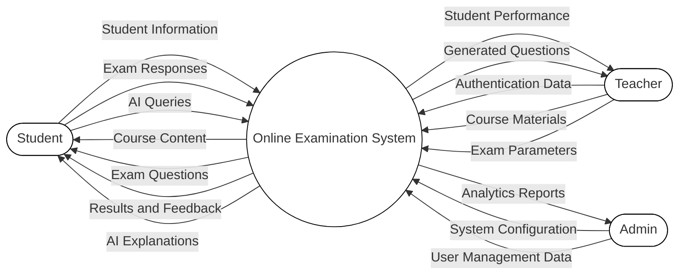
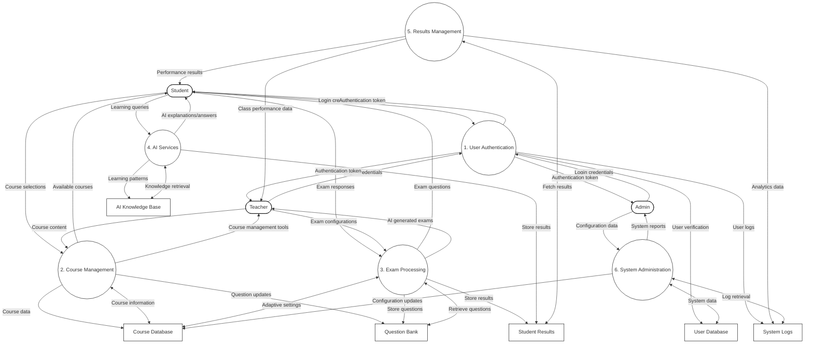
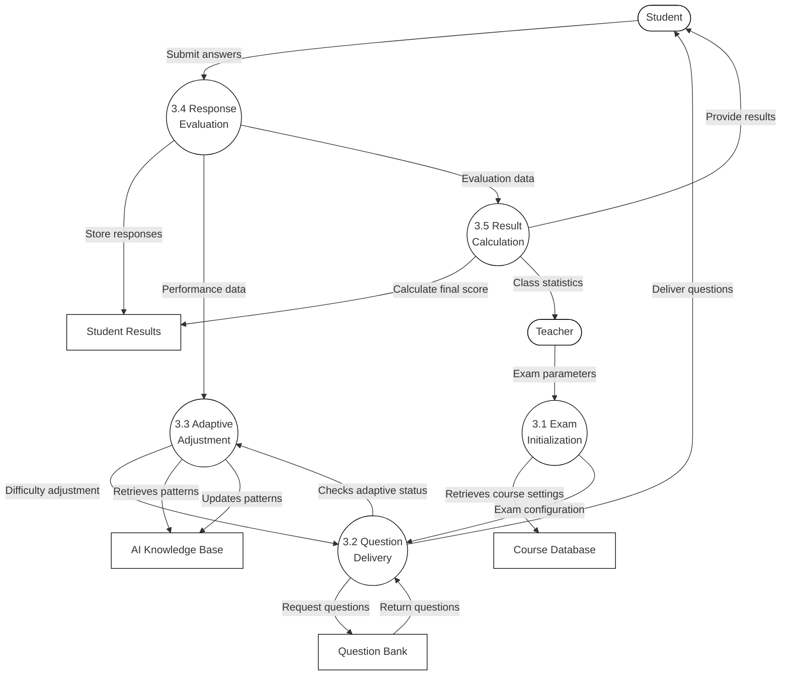
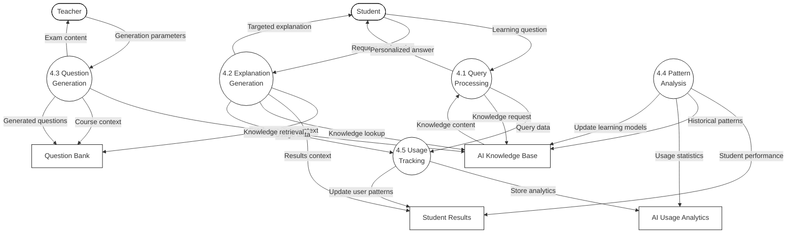

# Online Examination System - Data Flow Diagrams

## Level 0 Data Flow Diagram (Context Diagram)

## Level 1 Data Flow Diagram

## Level 2 Data Flow Diagram - Exam Processing Subsystem

## Level 2 Data Flow Diagram - AI Services Subsystem

## DFD Description

The Data Flow Diagrams (DFDs) above illustrate how data moves through the Online Examination System at increasing levels of detail:

### Level 0 (Context) Diagram
Shows the system as a single process interacting with three primary external entities:
- **Students**: Submit responses and queries, receive course content and results
- **Teachers**: Provide course materials and receive performance data
- **Administrators**: Configure the system and receive analytics

### Level 1 Diagram
Expands the system into six major processes with associated data stores:
1. **User Authentication**: Manages login and validation
2. **Course Management**: Handles course content and organization
3. **Exam Processing**: Manages question delivery and response handling
4. **AI Services**: Provides intelligent features for learning support
5. **Results Management**: Processes and displays performance data
6. **System Administration**: Manages system configuration and maintenance

Data stores include:
- User Database
- Course Database
- Question Bank
- Student Results
- AI Knowledge Base
- System Logs

### Level 2 - Exam Processing Subsystem
Details the internal processes involved in managing examinations:
1. **Exam Initialization**: Sets up exam parameters based on course settings
2. **Question Delivery**: Retrieves and presents questions to students
3. **Adaptive Adjustment**: Modifies question difficulty based on performance
4. **Response Evaluation**: Assesses answer correctness
5. **Result Calculation**: Computes final scores and statistics

### Level 2 - AI Services Subsystem
Breaks down the AI components that enhance learning:
1. **Query Processing**: Handles student questions to the AI tutor
2. **Explanation Generation**: Creates personalized explanations for questions
3. **Question Generation**: Automatically creates new assessment content
4. **Pattern Analysis**: Evaluates performance data for insights
5. **Usage Tracking**: Monitors AI interaction for analytics

These diagrams illustrate how data flows through the system, highlighting the integration of traditional examination processes with AI-enhanced capabilities to create an intelligent learning environment. 