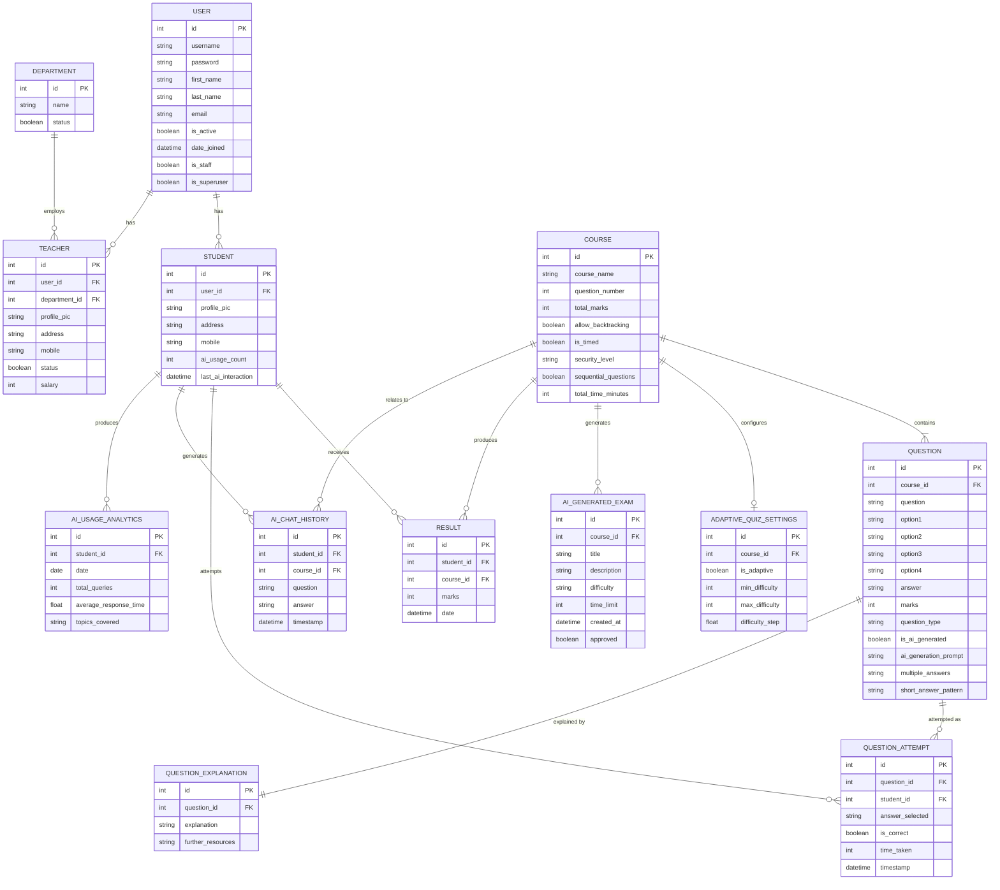

# Online Examination System - Entity Relationship Diagram

## Entity Relationship Diagram Description

This ERD represents the database structure for the Online Examination System, with a focus on displaying entities, their attributes, and relationships in a database context.

### Core Entities

#### User Management
- **USER**: Central entity storing authentication information
  - Primary users are further categorized into specific roles
- **STUDENT**: Extends USER with student-specific attributes
  - Tracks AI usage metrics and personal information
- **TEACHER**: Extends USER with teacher-specific attributes
  - Links to department and includes status and salary information
- **DEPARTMENT**: Organizational unit for teachers

#### Course Management
- **COURSE**: Represents subjects or exams
  - Contains configuration options for backtracking, timing, security
- **QUESTION**: Individual assessment items
  - Includes various question formats and AI generation flags
- **QUESTION_EXPLANATION**: Extended explanations for questions
  - Provides learning resources related to questions

#### Assessment
- **QUESTION_ATTEMPT**: Records individual question responses
  - Captures correctness, time taken, and selected answers
- **RESULT**: Stores overall exam performance
  - Links students to courses with timestamp and score

### AI Feature Entities

- **ADAPTIVE_QUIZ_SETTINGS**: Configuration for personalized exams
  - Controls difficulty progression parameters
- **AI_GENERATED_EXAM**: AI-created assessments for courses
  - Includes metadata about generation parameters and approval status
- **AI_CHAT_HISTORY**: Student interactions with AI assistant
  - Tracks questions, answers, and related courses
- **AI_USAGE_ANALYTICS**: Metrics about student AI usage
  - Aggregates usage patterns and topic coverage

### Key Relationships

1. **User Hierarchy**: USER entities can be either STUDENT or TEACHER
2. **Organizational**: TEACHERs belong to DEPARTMENTs
3. **Content**: COURSEs contain QUESTIONs, which have QUESTION_EXPLANATIONs
4. **Assessment**: STUDENTs make QUESTION_ATTEMPTs and receive RESULTs
5. **AI Interactions**: STUDENTs generate AI_CHAT_HISTORY and AI_USAGE_ANALYTICS
6. **Smart Features**: COURSEs have ADAPTIVE_QUIZ_SETTINGS and generate AI_GENERATED_EXAMs

### Cardinality Notes

- One USER can have at most one STUDENT or TEACHER profile (one-to-one)
- One COURSE can have many QUESTIONs (one-to-many)
- Each QUESTION can have exactly one QUESTION_EXPLANATION (one-to-one)
- STUDENTs can have many QUESTION_ATTEMPTs and RESULTs (one-to-many)
- COURSEs can have at most one ADAPTIVE_QUIZ_SETTINGS (one-to-one)

This database structure supports all the system requirements, including both traditional examination features and AI-enhanced capabilities. 