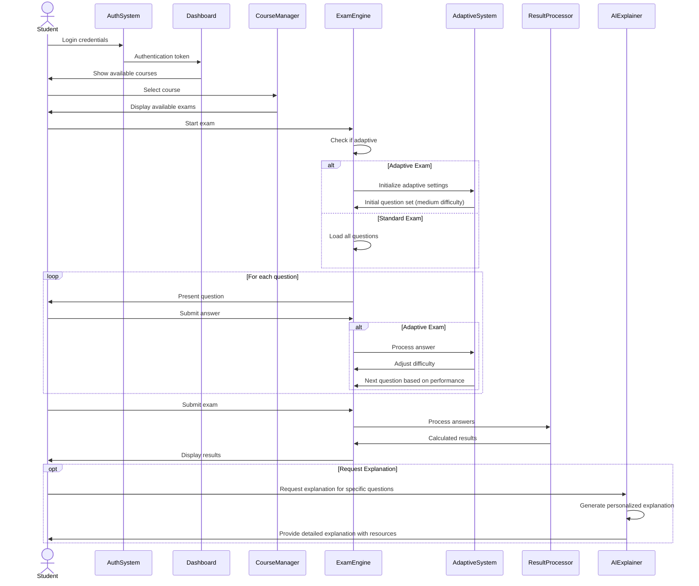
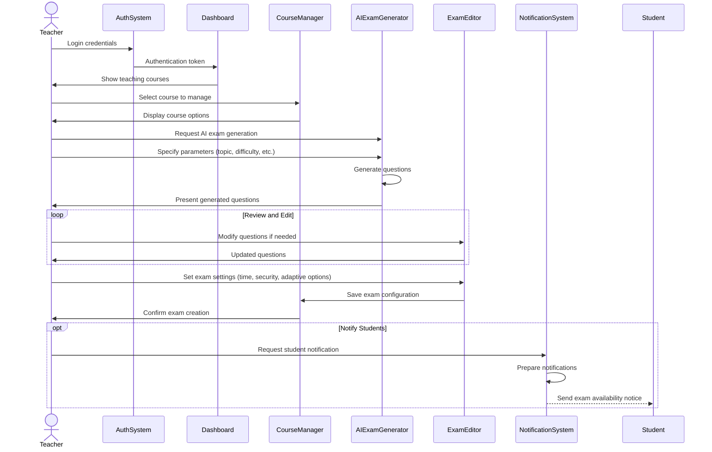
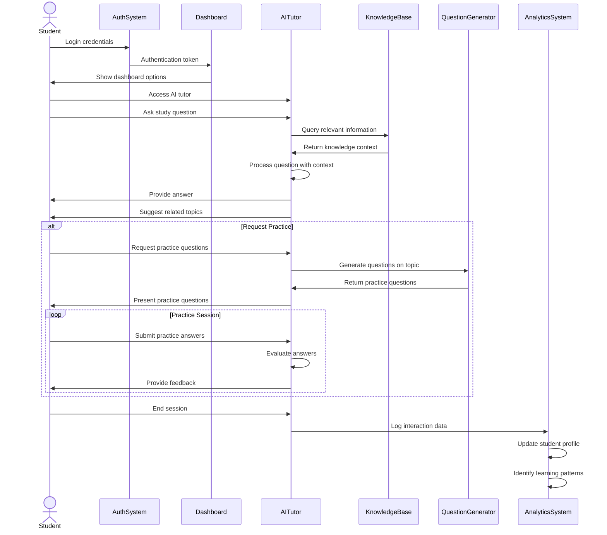
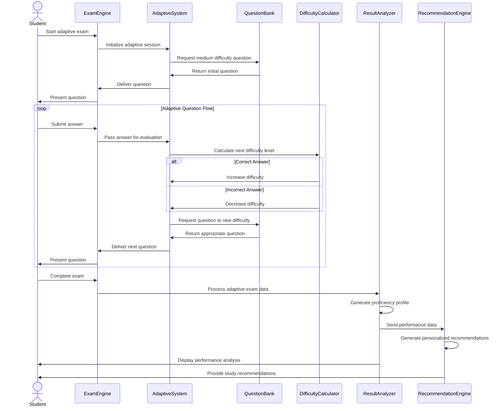

# Online Examination System - Sequence Diagrams

## Student Taking an Exam Sequence

## Teacher Creating AI-Generated Exam Sequence

## AI Tutoring Interaction Sequence

## Adaptive Exam Assessment Sequence

## Sequence Diagram Description

These sequence diagrams illustrate the detailed interactions between actors (users) and system components in the Online Examination System:

### Student Taking an Exam Sequence
Shows the complete flow of a student taking an exam, highlighting:
- Authentication and course/exam selection process
- Differences between standard and adaptive exam flows
- Question presentation and answer submission
- Results processing and optional AI explanations

### Teacher Creating AI-Generated Exam Sequence
Demonstrates how teachers use AI to streamline exam creation:
- Course selection and management options
- AI-based question generation with parameter specification
- Review and modification of AI-generated content
- Exam configuration and student notification

### AI Tutoring Interaction Sequence
Illustrates the student-AI interaction for learning support:
- Access to AI tutor from dashboard
- Question processing using knowledge base
- Related topic suggestions
- Practice question generation and feedback
- Analytics tracking for personalized learning

### Adaptive Exam Assessment Sequence
Details the sophisticated adaptive testing mechanism:
- Initialization with medium difficulty questions
- Dynamic difficulty adjustment based on performance
- Question selection from appropriate difficulty levels
- Comprehensive result analysis and recommendation generation

These sequence diagrams complement the activity diagrams by showing the specific system components involved in each process and the messages passed between them, providing a detailed technical view of the system interactions. 