# Online Examination System - Use Case Diagram

```mermaid
graph TD
    %% Actors
    Student((Student))
    Teacher((Teacher))
    Admin((Admin))
    AISystem((AI System))

    %% Use Cases - Authentication
    UC1[Login to System]
    UC2[Manage Profile]
    
    %% Use Cases - Student Functions
    UC3[View Available Courses]
    UC4[Take Standard Exam]
    UC5[Take Adaptive Exam]
    UC6[View Exam Results]
    UC7[Request AI Explanations]
    UC8[Use AI Tutor]
    UC9[Practice with Generated Questions]
    
    %% Use Cases - Teacher Functions
    UC10[Manage Courses]
    UC11[Create Exam Manually]
    UC12[Generate Exam with AI]
    UC13[Review and Edit Exams]
    UC14[Configure Adaptive Settings]
    UC15[View Student Results]
    UC16[Notify Students]
    
    %% Use Cases - Admin Functions
    UC17[Manage User Accounts]
    UC18[Configure System Settings]
    UC19[Manage Departments]
    UC20[View Usage Analytics]
    
    %% Use Cases - AI System Functions
    UC21[Generate Questions]
    UC22[Adapt Question Difficulty]
    UC23[Provide Explanations]
    UC24[Answer Student Queries]
    UC25[Track Learning Patterns]
    
    %% Relationships - Student
    Student --- UC1
    Student --- UC2
    Student --- UC3
    Student --- UC4
    Student --- UC5
    Student --- UC6
    Student --- UC7
    Student --- UC8
    Student --- UC9
    
    %% Relationships - Teacher
    Teacher --- UC1
    Teacher --- UC2
    Teacher --- UC10
    Teacher --- UC11
    Teacher --- UC12
    Teacher --- UC13
    Teacher --- UC14
    Teacher --- UC15
    Teacher --- UC16
    
    %% Relationships - Admin
    Admin --- UC1
    Admin --- UC2
    Admin --- UC17
    Admin --- UC18
    Admin --- UC19
    Admin --- UC20
    
    %% Relationships - AI System
    AISystem --- UC21
    AISystem --- UC22
    AISystem --- UC23
    AISystem --- UC24
    AISystem --- UC25
    
    %% Extensions and Inclusions
    UC5 -.-> UC4
    UC7 -.-> UC6
    UC9 -.-> UC8
    UC12 -.-> UC13
    UC14 -.-> UC13
    UC21 -.-> UC12
    UC22 -.-> UC5
    UC23 -.-> UC7
    UC24 -.-> UC8
    UC25 -.-> UC20
    
    %% Styling
    classDef actor fill:#f9f,stroke:#333,stroke-width:2px
    classDef usecase fill:#ccf,stroke:#333,stroke-width:1px
    
    class Student,Teacher,Admin,AISystem actor
    class UC1,UC2,UC3,UC4,UC5,UC6,UC7,UC8,UC9,UC10,UC11,UC12,UC13,UC14,UC15,UC16,UC17,UC18,UC19,UC20,UC21,UC22,UC23,UC24,UC25 usecase
```

## Alternative UML-Style Use Case Diagram

```mermaid
flowchart TD
    %% Define actors
    student([Student])
    teacher([Teacher])
    admin([Admin])
    ai([AI System])
    
    %% Define use case boundaries
    subgraph Authentication
        login["Login to System"]
        profile["Manage Profile"]
    end
    
    subgraph "Exam Taking"
        viewCourses["View Available Courses"]
        takeStandardExam["Take Standard Exam"]
        takeAdaptiveExam["Take Adaptive Exam"]
        viewResults["View Exam Results"]
        getAIExplanation["Request AI Explanations"]
    end
    
    subgraph "AI Learning Support"
        useAITutor["Use AI Tutor"]
        practiceQuestions["Practice with Generated Questions"]
    end
    
    subgraph "Course & Exam Management"
        manageCourses["Manage Courses"]
        createExam["Create Exam Manually"]
        generateAIExam["Generate Exam with AI"]
        reviewEditExam["Review and Edit Exams"]
        adaptiveSettings["Configure Adaptive Settings"]
        viewStudentResults["View Student Results"]
        notifyStudents["Notify Students"]
    end
    
    subgraph "System Administration"
        manageUsers["Manage User Accounts"]
        configureSystem["Configure System Settings"]
        manageDepartments["Manage Departments"]
        viewAnalytics["View Usage Analytics"]
    end
    
    subgraph "AI System Services"
        generateQuestions["Generate Questions"]
        adaptDifficulty["Adapt Question Difficulty"]
        provideExplanations["Provide Explanations"]
        answerQueries["Answer Student Queries"]
        trackPatterns["Track Learning Patterns"]
    end
    
    %% Connect actors to use cases
    student --- login
    student --- profile
    student --- viewCourses
    student --- takeStandardExam
    student --- takeAdaptiveExam
    student --- viewResults
    student --- getAIExplanation
    student --- useAITutor
    student --- practiceQuestions
    
    teacher --- login
    teacher --- profile
    teacher --- manageCourses
    teacher --- createExam
    teacher --- generateAIExam
    teacher --- reviewEditExam
    teacher --- adaptiveSettings
    teacher --- viewStudentResults
    teacher --- notifyStudents
    
    admin --- login
    admin --- profile
    admin --- manageUsers
    admin --- configureSystem
    admin --- manageDepartments
    admin --- viewAnalytics
    
    ai --- generateQuestions
    ai --- adaptDifficulty
    ai --- provideExplanations
    ai --- answerQueries
    ai --- trackPatterns
    
    %% Connect related use cases with dotted lines (extensions/inclusions)
    takeAdaptiveExam -.-> takeStandardExam
    getAIExplanation -.-> viewResults
    practiceQuestions -.-> useAITutor
    generateAIExam -.-> reviewEditExam
    adaptiveSettings -.-> reviewEditExam
    generateQuestions -.-> generateAIExam
    adaptDifficulty -.-> takeAdaptiveExam
    provideExplanations -.-> getAIExplanation
    answerQueries -.-> useAITutor
    trackPatterns -.-> viewAnalytics
    
    %% Styling
    classDef actor fill:#f9f,stroke:#333,stroke-width:2px
    classDef usecase fill:#ccf,stroke:#333,stroke-width:1px
    classDef boundary fill:none,stroke:#333,stroke-width:1px
    
    class student,teacher,admin,ai actor
    class login,profile,viewCourses,takeStandardExam,takeAdaptiveExam,viewResults,getAIExplanation,useAITutor,practiceQuestions,manageCourses,createExam,generateAIExam,reviewEditExam,adaptiveSettings,viewStudentResults,notifyStudents,manageUsers,configureSystem,manageDepartments,viewAnalytics,generateQuestions,adaptDifficulty,provideExplanations,answerQueries,trackPatterns usecase
    class Authentication,ExamTaking,AILearningSupport,CourseExamManagement,SystemAdministration,AISystemServices boundary
```

## Use Case Description

This use case diagram illustrates the primary actors and their interactions with the Online Examination System.

### Primary Actors

1. **Student**
   - Core users who take exams and use the system for learning
   - Primary interactions include exam-taking and AI learning support

2. **Teacher**
   - Create and manage exams and courses
   - Use AI tools to generate and configure assessments

3. **Admin**
   - Manage system settings and user accounts
   - Oversee departments and system analytics

4. **AI System**
   - Technical actor that provides intelligence services
   - Supports both students and teachers through various features

### Key Use Case Groups

#### Authentication
Common functionality for all human actors to access the system and manage their profiles.

#### Exam Taking
Student-centered use cases focused on course access, exam completion, and results review:
- Standard and adaptive exam modes represent different assessment approaches
- AI explanation requests extend the results viewing experience

#### AI Learning Support
Student-focused learning assistance outside formal exams:
- AI tutoring for question answering
- Practice sessions with AI-generated questions

#### Course & Exam Management
Teacher-focused administrative functions:
- Manual and AI-assisted exam creation
- Course management and student result monitoring
- Adaptive settings configuration for personalized assessments

#### System Administration
Admin-focused system configuration and oversight:
- User account management
- Department configuration
- System settings and analytics monitoring

#### AI System Services
Background services provided by the AI actor:
- Question generation for exams and practice
- Difficulty adaptation for personalized assessment
- Explanation provision for learning support
- Query responses for tutoring interactions
- Pattern tracking for analytics

### Relationships
The diagram shows both direct associations between actors and use cases (solid lines) and relationships between use cases (dotted lines) that represent extensions or inclusions:

- Taking adaptive exams extends standard exam taking
- AI explanations extend results viewing
- Adaptive settings and AI generation feed into exam creation
- AI services support their respective student and teacher features

This comprehensive use case diagram maps the full range of system functionality across all user types, highlighting both traditional examination features and AI-enhanced capabilities. 