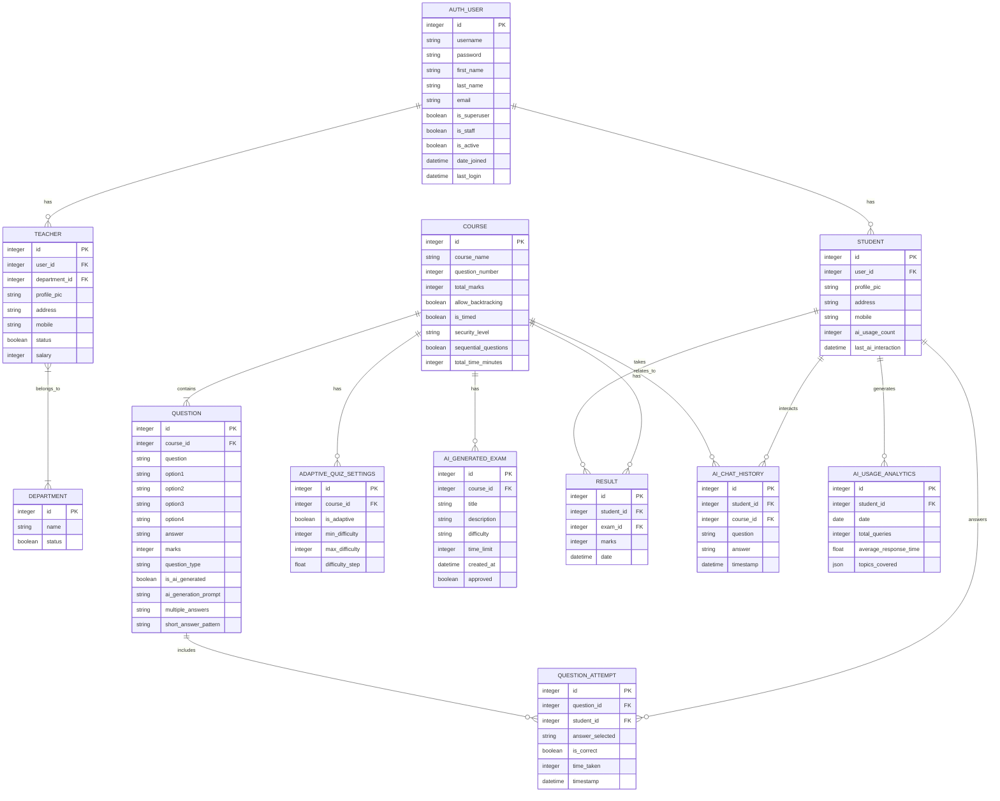

# Online Examination System - Entity Relationship Diagram

## ERD Description

The Entity Relationship Diagram above illustrates the database schema for the Online Examination System with AI features. Here's an explanation of the key entities and their relationships:

### User Management
- **AUTH_USER**: Central user entity containing authentication details
- **STUDENT**: Extends AUTH_USER with student-specific attributes
- **TEACHER**: Extends AUTH_USER with teacher-specific attributes
- **DEPARTMENT**: Organizes teachers by academic department

### Course and Examination
- **COURSE**: Represents academic courses or subjects
- **QUESTION**: Stores exam questions associated with courses
- **QUESTION_ATTEMPT**: Records student attempts at answering questions
- **RESULT**: Tracks student exam results for specific courses

### AI Features
- **AI_GENERATED_EXAM**: Stores exams created by AI for specific courses
- **ADAPTIVE_QUIZ_SETTINGS**: Configures adaptive learning parameters for courses
- **AI_CHAT_HISTORY**: Records interactions between students and the AI assistant
- **AI_USAGE_ANALYTICS**: Tracks and analyzes student usage of AI features

### Key Relationships
1. Each AUTH_USER can be either a STUDENT or TEACHER (or admin)
2. TEACHERs belong to DEPARTMENTs
3. COURSEs contain QUESTIONs
4. STUDENTs take exams (RESULT) for COURSEs
5. STUDENTs answer QUESTIONs (QUESTION_ATTEMPT)
6. COURSEs may have ADAPTIVE_QUIZ_SETTINGS for personalized learning
7. AI_GENERATED_EXAMs are created for specific COURSEs
8. STUDENTs interact with AI and generate usage analytics

This schema supports all the AI-enhanced features described in the system documentation, including AI exam generation, adaptive exams, AI study assistance, and usage analytics. 